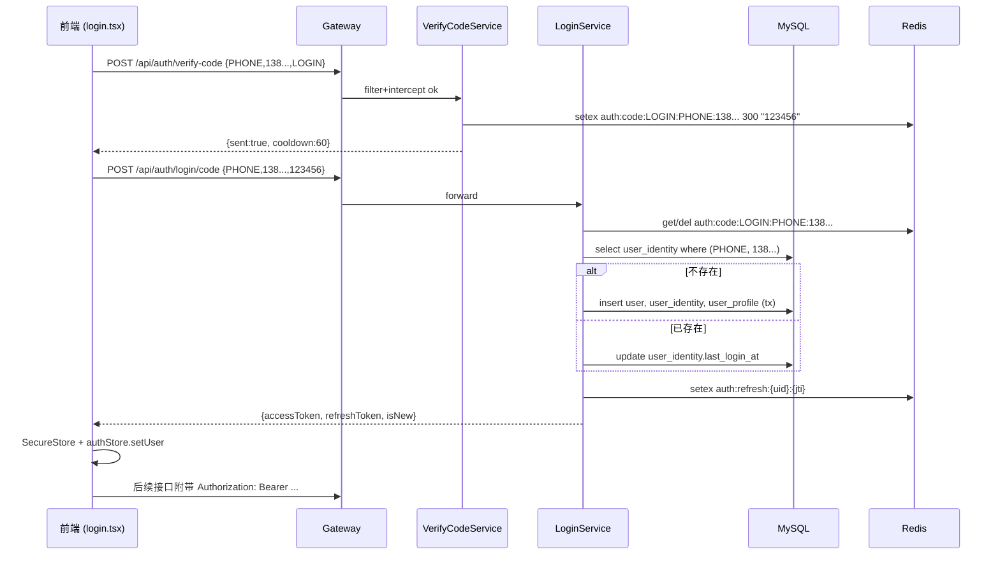
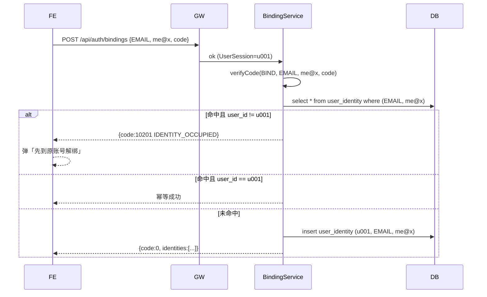

# Kairos-kakomon 后端 TRD 设计文档

> 模块范围：登录 / 注册 / 三方登录预留 / 用户资料编辑 / 用户设置 / 学校 · 研究科 · 专业字典
> 版本：v1.2
> 编写日期：2026-06-16（v1.1 增补「学校 / 研究科 / 专业」字典；v1.2 收窄字典模块到学校/学院/专业三层，剥离评分排名与教授）
> 适用前端：`Kairos-kakomon`（Expo + React Native，登录入口 `app/(auth)/login.tsx`、完善资料 `app/(auth)/onboard-profile.tsx`、个人资料编辑 `app/edit-profile.tsx`、设置 `app/settings.tsx`）
> 适用后端：`Kairos-kakomon-server`（Spring Boot 4.0.7 / Java 17 / MyBatis / MySQL / Redis）

---

## 目录

1. [设计目标与范围](#1-设计目标与范围)
2. [技术选型与依赖](#2-技术选型与依赖)
3. [包结构（依据后端规范）](#3-包结构依据后端规范)
4. [核心模型：用户与身份的解耦](#4-核心模型用户与身份的解耦)
5. [数据库设计](#5-数据库设计)
6. [学校 / 研究科 / 专业 字典模块](#6-学校--研究科--专业-字典模块)
7. [Gateway（拦截器/过滤器）设计](#7-gateway拦截器过滤器设计)
8. [鉴权与会话](#8-鉴权与会话)
9. [接口规约（HTTP API）](#9-接口规约http-api)
10. [关键业务流程](#10-关键业务流程)
11. [错误码定义](#11-错误码定义)
12. [配置与环境变量](#12-配置与环境变量)
13. [安全与合规要求](#13-安全与合规要求)
14. [前后端字段映射](#14-前后端字段映射)
15. [里程碑与待办（不在 v1 范围）](#15-里程碑与待办不在-v1-范围)

---

## 1. 设计目标与范围

### 1.1 业务目标

参考小红书 / 抖音的登录态体系，实现 **「同一用户多身份」** 的账号模型：

- 用户首次用 **手机号 + 验证码** 登录 → 后端自动建账号、签发 token，并把手机号写入 `user_identity` 表（type=`PHONE`）。
- 该用户在 App 内补绑 **邮箱** → 后端把邮箱写入同一用户的 `user_identity` 表（type=`EMAIL`）。
- 之后无论使用手机号还是邮箱（+密码或+验证码）登录，落地的是 **同一个 user_id**。
- 三方登录（微信 / LINE / Apple）**v1 不实现**，但表结构与接口预留，且约定后续实现规则：三方登录成功后必须绑定手机号才能继续使用，若手机号已绑定其他账号则需先解绑。
- 任意身份（phone / email / openId）在系统内全局唯一，被占用时必须先解绑再绑定。

### 1.2 功能范围（v1）

| 域 | 接口 |
|---|---|
| 验证码 | 发送验证码（手机/邮箱共用一套） |
| 登录注册 | 验证码登录注册（首登即注册）、密码登录、登出 |
| Token | 刷新 token、当前用户信息 |
| 绑定 | 绑定手机号、绑定邮箱、设置/修改密码 |
| 解绑 | 解绑手机号、解绑邮箱（不允许仅剩 1 个登录身份且未设置密码） |
| 资料 | 拉取我的资料、编辑资料（昵称、bio、头像色、专业方向、目标学校、考试日期） |
| 设置 | 通知开关、外观主题（前端本地态，后端不持久化）|

不在范围内：贡献分体系、AI 配额计费、目标学校的子科目细节等业务流，仅提供字段透传位置。

### 1.3 非功能性要求

- 接口 P99 < 300ms（不含外部短信/邮件网关）。
- 验证码 5 分钟内有效，60s 内不允许重发。
- 同一手机号/邮箱每日发送验证码 ≤ 10 次，每 IP ≤ 100 次。
- 登录失败连续 5 次锁定 10 分钟（基于 Redis 计数）。
- token 默认 7 天有效，refresh token 30 天。
- 所有写库操作幂等键来自 `request_id`（前端可选传入；缺省由后端生成日志用 traceId）。

---

## 2. 技术选型与依赖

继承 `pom.xml` 已声明的栈：

| 类别 | 选型 |
|---|---|
| 框架 | Spring Boot 4.0.7（Web MVC） |
| JDK | 17 |
| 持久化 | MyBatis-Spring-Boot-Starter 4.0.1 + MySQL 8.x |
| 缓存 | Redis（Spring Data Redis） |
| 文档/搜索 | MongoDB / Elasticsearch（v1 登录域不使用） |
| Token | 自实现 JWT（HS256） — 引入 `io.jsonwebtoken:jjwt-api/impl/jackson` |
| 短信 | 抽象接口 `SmsSender`，v1 用 LogSmsSender（写日志），生产环境换阿里云/腾讯云实现 |
| 邮件 | `spring-boot-starter-mail`（v1 可用 LogMailSender 占位） |
| 参数校验 | `spring-boot-starter-validation`（Hibernate Validator） |
| 工具 | Lombok（如团队同意）、MapStruct（实体↔DTO） |

> 需要在 `pom.xml` 增补的依赖：`jjwt`、`spring-boot-starter-validation`、`spring-boot-starter-mail`、`commons-lang3`。

---

## 3. 包结构（依据后端规范）

按 `preparationWork/后端规范.md` 落地：

```
org.example
├── KairosKakomonServerApplication.java
│
├── common/                        # 通用常量、Result、枚举
│   ├── Result.java                # 统一返回结构 {code, message, data, traceId}
│   ├── ResultCode.java            # 错误码枚举
│   ├── enums/
│   │   ├── IdentityType.java      # PHONE / EMAIL / WECHAT / APPLE / LINE
│   │   ├── VerifyCodeScene.java   # LOGIN / BIND / UNBIND / RESET_PASSWORD
│   │   └── UserStatus.java        # ACTIVE / FROZEN / DELETED
│   ├── constant/
│   │   ├── CacheKeys.java         # Redis Key 模板
│   │   └── HeaderKeys.java        # X-Auth-Token、X-Trace-Id 等
│   └── exception/
│       ├── BizException.java
│       └── GlobalExceptionHandler.java   # @RestControllerAdvice
│
├── config/                        # 配置类
│   ├── MybatisConfig.java
│   ├── RedisConfig.java
│   ├── WebMvcConfig.java          # 注册拦截器 / CORS / 全局参数解析
│   ├── ThreadPoolConfig.java
│   ├── JwtProperties.java         # @ConfigurationProperties("auth.jwt")
│   └── RateLimitProperties.java
│
├── entity/                        # 数据库实体
│   ├── UserEntity.java
│   ├── UserIdentityEntity.java
│   ├── UserCredentialEntity.java
│   ├── UserProfileEntity.java
│   ├── UserTargetSchoolEntity.java
│   ├── LoginAuditEntity.java
│   ├── UniversityEntity.java
│   ├── GradSchoolEntity.java
│   └── MajorEntity.java
│
├── model/
│   ├── request/
│   │   ├── auth/
│   │   │   ├── SendCodeRequest.java
│   │   │   ├── LoginByCodeRequest.java
│   │   │   ├── LoginByPasswordRequest.java
│   │   │   ├── RefreshTokenRequest.java
│   │   │   ├── BindIdentityRequest.java
│   │   │   ├── UnbindIdentityRequest.java
│   │   │   └── SetPasswordRequest.java
│   │   └── user/
│   │       ├── PatchProfileRequest.java
│   │       └── UpdateTargetSchoolsRequest.java
│   ├── response/
│   │   ├── auth/
│   │   │   ├── LoginResponse.java          # accessToken/refreshToken/user
│   │   │   └── SendCodeResponse.java
│   │   ├── user/
│   │   │   ├── UserResponse.java           # 整体资料（含 identities[]）
│   │   │   └── IdentityResponse.java
│   │   └── dict/
│   │       ├── UniversityResponse.java     # 列表/详情共用
│   │       ├── UniversityTreeResponse.java # 全量学校→研究科→专业
│   │       ├── GradSchoolResponse.java
│   │       └── MajorResponse.java
│   └── bo/
│       ├── LoginContext.java               # 登录链路上下文
│       ├── IdentityKey.java                # type+value 归一化
│       ├── UserSession.java                # 拦截器注入的当前用户上下文
│       └── DictionaryVersion.java          # 字典版本号封装
│
├── gateway/                       # 拦截器、过滤器、上下文
│   ├── filter/
│   │   ├── TraceIdFilter.java              # OncePerRequestFilter,顺序 -100
│   │   ├── BodyCacheFilter.java            # ContentCachingRequestWrapper,便于审计/重放
│   │   └── RateLimitFilter.java            # IP+URI 滑窗限流,顺序 -50
│   ├── interceptor/
│   │   ├── AuthInterceptor.java            # 解析 token,挂 UserSession
│   │   ├── LoginRequiredInterceptor.java   # 强制登录态(注解+白名单)
│   │   └── ApiSignInterceptor.java         # 可选,移动端签名校验
│   ├── context/
│   │   ├── UserContextHolder.java          # ThreadLocal<UserSession>
│   │   └── UserSessionResolver.java        # @CurrentUser 参数解析
│   └── annotation/
│       ├── PublicApi.java                  # 标注无需登录
│       └── CurrentUser.java                # 注入当前 UserSession
│
├── web/                           # Controller
│   ├── auth/
│   │   ├── VerifyCodeController.java       # POST /api/auth/verify-code
│   │   ├── LoginController.java            # /api/auth/login/* /logout /refresh
│   │   └── BindingController.java          # /api/auth/bindings/*
│   ├── user/
│   │   ├── UserController.java             # GET/PATCH /api/users/me
│   │   └── TargetSchoolController.java     # PUT /api/users/me/target-schools
│   └── dict/
│       ├── UniversityDictController.java   # /api/dict/universities/**
│       └── DictMetaController.java         # /api/dict/version
│
├── service/
│   ├── auth/
│   │   ├── VerifyCodeService.java
│   │   ├── VerifyCodeServiceImpl.java
│   │   ├── LoginService.java
│   │   ├── LoginServiceImpl.java
│   │   ├── TokenService.java               # JWT 签发/解析/吊销
│   │   ├── TokenServiceImpl.java
│   │   ├── BindingService.java
│   │   └── BindingServiceImpl.java
│   ├── user/
│   │   ├── UserService.java
│   │   └── UserServiceImpl.java
│   ├── dict/
│   │   ├── DictionaryService.java          # 学校/研究科/专业 读接口
│   │   ├── DictionaryServiceImpl.java
│   │   └── DictionaryCacheManager.java     # Redis 全量缓存 + 版本号
│   ├── notify/
│   │   ├── SmsSender.java                  # 接口
│   │   ├── LogSmsSender.java               # v1 实现
│   │   ├── MailSender.java
│   │   └── LogMailSender.java
│   └── ratelimit/
│       └── RateLimitService.java           # 基于 Redis 的滑窗
│
└── mapper/
    ├── auth/
    │   ├── UserCredentialMapper.java       # 含 .xml
    │   └── LoginAuditMapper.java
    ├── user/
    │   ├── UserMapper.java
    │   ├── UserIdentityMapper.java
    │   ├── UserProfileMapper.java
    │   └── UserTargetSchoolMapper.java
    └── dict/
        ├── UniversityMapper.java
        ├── GradSchoolMapper.java
        └── MajorMapper.java
```

---

## 4. 核心模型：用户与身份的解耦

### 4.1 概念

参考小红书 / 抖音的做法，**「用户主体」** 与 **「登录身份」** 是 1 : N 的关系：

```
┌────────────────────────────┐
│ user (用户主体, 主键 user_id) │
└────────────────────────────┘
            ▲ 1
            │
            │ N
┌────────────────────────────────────────────────┐
│ user_identity (登录身份)                         │
│   id, user_id, identity_type, identity_value    │
│   identity_type ∈ PHONE / EMAIL / WECHAT / ...  │
│   UNIQUE (identity_type, identity_value)        │ ← 全局唯一
└────────────────────────────────────────────────┘
```

- 用户登录手机号 `13812345678` → 找 `user_identity` 表，命中 `user_id=u001` → 用 `u001` 签发 token。
- 用户登录邮箱 `me@kakomon.app` → 命中 `user_id=u001` → 同一个用户。
- 绑定时若 `identity_value` 已属于其他 `user_id` → 抛 `IDENTITY_OCCUPIED`，前端引导用户先去原账号解绑再来绑。

### 4.2 多身份合一规则（业务约束）

| 场景 | 规则 |
|---|---|
| 首次手机号验证码登录 | 创建 `user` + `user_identity(PHONE)` + `user_profile`（昵称默认 "小k"），返回 `isNew=true` |
| 首次邮箱验证码登录 | 创建 `user` + `user_identity(EMAIL)` + `user_profile`，返回 `isNew=true` |
| 已存在用户的密码登录 | 必须存在该 identity 且 `user_credential.password_hash` 不为空 |
| 已登录用户绑定手机号 | 若该手机号在 `user_identity` 已存在且属于他人 → `IDENTITY_OCCUPIED`；否则 INSERT 一行 |
| 已登录用户绑定邮箱 | 同上 |
| 解绑 | 仅剩 1 个登录身份 **且** 未设置密码 → `LAST_IDENTITY_FORBIDDEN`；否则 DELETE |
| 三方登录（v1 预留） | 三方回调命中 `user_identity(WECHAT/APPLE/LINE)` → 直接登录；未命中 → 创建匿名 user 并跳到「绑定手机号」必经流程 |

### 4.3 与前端字段对齐

前端 `UserProfile`（`src/types/user.ts`）字段不变，后端在响应里追加 `identities` 数组：

```jsonc
{
  "id": "u_xxx",
  "nickname": "小k",
  "phone": "13800001111",      // 取自 identities[type=PHONE].value
  "email": "me@kakomon.app",   // 取自 identities[type=EMAIL].value
  "identities": [
    { "type": "PHONE", "value": "13800001111", "boundAt": "2026-06-01T10:00:00Z" },
    { "type": "EMAIL", "value": "me@kakomon.app", "boundAt": "2026-06-10T08:00:00Z" }
  ],
  ...
}
```

> 兼容前端当前 mock：`UserProfile.email` 是「主邮箱」，前端会把 `xxx@phone.kakomon.local` 视为占位。后端正式实现后不再返回该占位串，未绑定邮箱时 `email` 字段返回空字符串或省略，前端渲染逻辑（`!user.email.endsWith('@phone.kakomon.local')`）保持不变即可正确处理。

---

## 5. 数据库设计

### 5.1 ER 概览

```
user ───< user_identity
  │
  ├──── user_credential (1:1, 可空 — 仅密码登录用户才有)
  │
  ├──── user_profile (1:1)
  │
  └──── user_target_school (1:N)

login_audit (登录审计日志, 关联 user_id 可空)
verify_code_log (发送审计, 不强关联用户)
```

### 5.2 表结构（MySQL 8.x，utf8mb4）

#### 5.2.1 `user` — 用户主体

```sql
CREATE TABLE `user` (
  `id`            BIGINT UNSIGNED NOT NULL AUTO_INCREMENT,
  `user_no`       CHAR(20)        NOT NULL COMMENT '业务主键, 雪花/ULID, 暴露给前端',
  `status`        TINYINT         NOT NULL DEFAULT 1 COMMENT '1=ACTIVE, 2=FROZEN, 3=DELETED',
  `register_from` VARCHAR(20)     NOT NULL COMMENT 'PHONE/EMAIL/WECHAT/APPLE/LINE',
  `created_at`    DATETIME(3)     NOT NULL DEFAULT CURRENT_TIMESTAMP(3),
  `updated_at`    DATETIME(3)     NOT NULL DEFAULT CURRENT_TIMESTAMP(3) ON UPDATE CURRENT_TIMESTAMP(3),
  `deleted_at`    DATETIME(3)     NULL,
  PRIMARY KEY (`id`),
  UNIQUE KEY `uk_user_no` (`user_no`),
  KEY `idx_status` (`status`),
  KEY `idx_created_at` (`created_at`)
) COMMENT='用户主体';
```

#### 5.2.2 `user_identity` — 登录身份（多对一核心）

```sql
CREATE TABLE `user_identity` (
  `id`              BIGINT UNSIGNED NOT NULL AUTO_INCREMENT,
  `user_id`         BIGINT UNSIGNED NOT NULL,
  `identity_type`   VARCHAR(20)     NOT NULL COMMENT 'PHONE/EMAIL/WECHAT/APPLE/LINE',
  `identity_value`  VARCHAR(255)    NOT NULL COMMENT '手机号 / 邮箱(小写) / openId',
  `verified`        TINYINT         NOT NULL DEFAULT 1,
  `is_primary`      TINYINT         NOT NULL DEFAULT 0 COMMENT '该 type 内是否为主身份',
  `bound_at`        DATETIME(3)     NOT NULL DEFAULT CURRENT_TIMESTAMP(3),
  `last_login_at`   DATETIME(3)     NULL,
  `created_at`      DATETIME(3)     NOT NULL DEFAULT CURRENT_TIMESTAMP(3),
  `updated_at`      DATETIME(3)     NOT NULL DEFAULT CURRENT_TIMESTAMP(3) ON UPDATE CURRENT_TIMESTAMP(3),
  PRIMARY KEY (`id`),
  UNIQUE KEY `uk_type_value` (`identity_type`, `identity_value`),
  KEY `idx_user_id` (`user_id`),
  KEY `idx_user_type` (`user_id`, `identity_type`)
) COMMENT='用户登录身份';
```

> `uk_type_value` 是 **「全局唯一」** 的硬约束，保证一个手机号/邮箱只能挂在一个 `user_id` 上。绑定流程的 `IDENTITY_OCCUPIED` 错误依靠它防并发。

#### 5.2.3 `user_credential` — 密码凭据（1:1，可空）

```sql
CREATE TABLE `user_credential` (
  `user_id`        BIGINT UNSIGNED NOT NULL,
  `password_hash`  VARCHAR(100)    NOT NULL COMMENT 'BCrypt 60 字符',
  `password_salt`  VARCHAR(64)     NOT NULL,
  `failed_count`   INT             NOT NULL DEFAULT 0,
  `locked_until`   DATETIME(3)     NULL,
  `updated_at`     DATETIME(3)     NOT NULL DEFAULT CURRENT_TIMESTAMP(3) ON UPDATE CURRENT_TIMESTAMP(3),
  PRIMARY KEY (`user_id`)
) COMMENT='用户密码凭据';
```

#### 5.2.4 `user_profile` — 资料（1:1）

```sql
CREATE TABLE `user_profile` (
  `user_id`              BIGINT UNSIGNED NOT NULL,
  `nickname`             VARCHAR(30)     NOT NULL DEFAULT '小k',
  `bio`                  VARCHAR(120)    NULL,
  `avatar_url`           VARCHAR(512)    NULL,
  `avatar_color`         VARCHAR(20)     NULL  COMMENT '前端预设色 token',
  `major`                VARCHAR(120)    NULL  COMMENT '前端 selectedMajor.label 整串',
  `next_exam_name`       VARCHAR(60)     NULL,
  `next_exam_date`       DATE            NULL,
  `next_exam_duration`   SMALLINT        NULL,
  `is_pro`               TINYINT         NOT NULL DEFAULT 0,
  `free_ai_remaining`    INT             NOT NULL DEFAULT 1,
  `token_balance`        INT             NOT NULL DEFAULT 0,
  `solved_count`         INT             NOT NULL DEFAULT 0,
  `unclear_count`        INT             NOT NULL DEFAULT 0,
  `wrong_count`          INT             NOT NULL DEFAULT 0,
  `favorite_count`       INT             NOT NULL DEFAULT 0,
  `ai_ask_count`         INT             NOT NULL DEFAULT 0,
  `contributor_points`   INT             NOT NULL DEFAULT 0,
  `onboarding_completed` TINYINT         NOT NULL DEFAULT 0,
  `created_at`           DATETIME(3)     NOT NULL DEFAULT CURRENT_TIMESTAMP(3),
  `updated_at`           DATETIME(3)     NOT NULL DEFAULT CURRENT_TIMESTAMP(3) ON UPDATE CURRENT_TIMESTAMP(3),
  PRIMARY KEY (`user_id`)
) COMMENT='用户资料';
```

#### 5.2.5 `user_target_school` — 目标学校（1:N）

```sql
CREATE TABLE `user_target_school` (
  `id`            BIGINT UNSIGNED NOT NULL AUTO_INCREMENT,
  `user_id`       BIGINT UNSIGNED NOT NULL,
  `university_id` VARCHAR(40)     NOT NULL,
  `school_type`   VARCHAR(20)     NOT NULL DEFAULT 'daigakuin' COMMENT 'daigakuin/gakubu',
  `grad_school`   VARCHAR(80)     NULL,
  `major_id`      VARCHAR(80)     NULL,
  `subjects`      JSON            NULL  COMMENT '科目数组',
  `priority`      INT             NOT NULL DEFAULT 1,
  `created_at`    DATETIME(3)     NOT NULL DEFAULT CURRENT_TIMESTAMP(3),
  `updated_at`    DATETIME(3)     NOT NULL DEFAULT CURRENT_TIMESTAMP(3) ON UPDATE CURRENT_TIMESTAMP(3),
  PRIMARY KEY (`id`),
  KEY `idx_user_priority` (`user_id`, `priority`)
) COMMENT='用户目标学校';
```

#### 5.2.6 `login_audit` — 登录审计

```sql
CREATE TABLE `login_audit` (
  `id`             BIGINT UNSIGNED NOT NULL AUTO_INCREMENT,
  `user_id`        BIGINT UNSIGNED NULL,
  `identity_type`  VARCHAR(20)     NOT NULL,
  `identity_value` VARCHAR(255)    NOT NULL,
  `login_method`   VARCHAR(20)     NOT NULL COMMENT 'CODE/PASSWORD/REFRESH/THIRD_PARTY',
  `success`        TINYINT         NOT NULL,
  `fail_reason`    VARCHAR(64)     NULL,
  `client_ip`      VARCHAR(64)     NULL,
  `user_agent`     VARCHAR(255)    NULL,
  `device_id`      VARCHAR(80)     NULL,
  `trace_id`       CHAR(32)        NULL,
  `created_at`     DATETIME(3)     NOT NULL DEFAULT CURRENT_TIMESTAMP(3),
  PRIMARY KEY (`id`),
  KEY `idx_user_id_created` (`user_id`, `created_at`),
  KEY `idx_identity` (`identity_type`, `identity_value`)
) COMMENT='登录审计';
```

#### 5.2.7 `verify_code_log` — 验证码发送审计（可选 / 用于风控复盘）

```sql
CREATE TABLE `verify_code_log` (
  `id`             BIGINT UNSIGNED NOT NULL AUTO_INCREMENT,
  `identity_type`  VARCHAR(20)     NOT NULL,
  `identity_value` VARCHAR(255)    NOT NULL,
  `scene`          VARCHAR(20)     NOT NULL COMMENT 'LOGIN/BIND/UNBIND/RESET_PASSWORD',
  `client_ip`      VARCHAR(64)     NULL,
  `created_at`     DATETIME(3)     NOT NULL DEFAULT CURRENT_TIMESTAMP(3),
  PRIMARY KEY (`id`),
  KEY `idx_identity_created` (`identity_type`, `identity_value`, `created_at`)
) COMMENT='验证码发送审计';
```

> 验证码 **本身** 不入库，仅放在 Redis；本表只记发送动作的频次/风控指标。

### 5.3 Redis Key 规约

| Key 模板 | 含义 | TTL |
|---|---|---|
| `auth:code:{scene}:{type}:{value}` | 当前有效验证码（值=6 位数字） | 5 min |
| `auth:code:cd:{type}:{value}` | 重发倒计时占位 | 60 s |
| `auth:code:daily:{type}:{value}` | 单标识当日发送计数 | 当日 24:00 |
| `auth:code:ip:{ip}` | IP 当日发送计数 | 当日 24:00 |
| `auth:login:fail:{type}:{value}` | 密码登录失败次数 | 10 min |
| `auth:token:revoked:{jti}` | 已吊销 access token jti | 与 token 剩余 TTL 同 |
| `auth:refresh:{userId}:{jti}` | 有效 refresh token | 30 d |
| `ratelimit:{ip}:{uri}` | 接口滑窗计数 | 滑窗长度 |

---

## 6. 学校 / 研究科 / 专业 字典模块

> 用户在 onboarding（`onboard-profile.tsx`）、个人资料编辑（`edit-profile.tsx`）和设置（`settings.tsx`）里都需要按 「学校 → 研究科 / 学院 → 专业」 三级选择。前端目前用 `KAKOMON_UNIVERSITIES`、`UNI_GRADS`、`UNI_MAJORS` 三份 mock 提供，正式上线后必须由后端从数据库读取。
>
> **范围限定**：本字典模块只为「用户资料里选学校 / 学院 / 专业」服务，仅落地这三层数据。前端 `KAKOMON_UNIVERSITIES` 中的评分（`rating`、`dimensions`、`qsRank`、`domesticRank`、`subjectRanks`）、口碑统计（`reviewCount`）、过去问数量（`pastExamCount`）、热门科目（`hotSubjects`）、教授（`professorHighlights`、`ProfessorDetail`）、口碑评论（`UniversityReview`）等字段 **不在 v1 字典模块范围**，由各自业务域单独建表（如「学校详情看板 / 教授库 / 评论」），与本模块解耦。

### 6.1 业务诉求与字段来源

| 前端调用 | 字段需求 | 来源（前端 mock） |
|---|---|---|
| 大学列表（搜索 / 区域 / 类型筛选，用于「选目标学校」）| code / nameCn / nameJp / nameEn / short / type / regionGroup / region / status / sortOrder | `KAKOMON_UNIVERSITIES`（`src/mocks/data.ts:87`，仅取基础字段，不含评分/排名）|
| 学院 / 研究科列表 | code / nameJp / category | `UNI_GRADS`（同上 :7）|
| 专业列表 | code / label / short / desc / subjects | `UNI_MAJORS`（同上 :25）|
| 用户编辑资料的目标学校选择 | 上述三级 + 多选目标学校（type=`daigakuin/gakubu`）+ 子科目数组 | `app/(auth)/onboard-profile.tsx`、`app/edit-profile.tsx` |

### 6.2 总体设计原则

1. **字典与业务表分离**：`university` / `grad_school` / `major` 是字典型实体，`user_target_school` 通过 `code` 引用它们，不冗余字典字段，避免学校改名导致历史数据漂移。
2. **稳定业务主键**：所有字典表保留 `code`（短串，如 `todai`、`info-rikō`、`cs`）作为对外暴露 ID，前端继续用 `universityId='todai'` 这种字符串引用，避免后端自增 id 泄露给客户端。
3. **多语言字段**：学校 / 研究科 / 专业的名称都包含中 / 日 / 英栏位，最少必填日文（这是 mock 中的核心展示语言），中文与英文为可选。
4. **字段最小化**：本模块只保留「让用户能在选择器里准确识别学校 / 学院 / 专业」所必需的字段，不再做评分、排名、过去问统计、教授等一切统计 / 业务字段。
5. **批量加载 + 缓存**：字典几乎只读、全量数据约几 KB ~ 几十 KB。提供 **整树批量接口** 给前端启动时一次性拉取并缓存到 `Zustand` / `AsyncStorage`，并在服务端用 Redis 全量缓存（key 带版本号便于一键失效）。
6. **运维写入 v1 不在范围**：v1 由 SQL 初始化脚本灌库（`preparationWork/sql/`），后续接管理后台。

### 6.3 ER 概览

```
university ──< grad_school ──< major

user_target_school ── ref university.code, grad_school.code, major.code
                       (字符串外键, 非物理 FK 以兼容数据补录)
```

3 张表，无附加表。`user_target_school` 已在 §5.2.5 定义，本节只新增 3 张字典表。

### 6.4 表结构（MySQL 8.x，utf8mb4）

#### 6.4.1 `university` — 大学字典

```sql
CREATE TABLE `university` (
  `id`             BIGINT UNSIGNED NOT NULL AUTO_INCREMENT,
  `code`           VARCHAR(40)     NOT NULL COMMENT '前端 universityId, e.g. todai',
  `name_cn`        VARCHAR(80)     NULL  COMMENT '中文名, e.g. 东京大学',
  `name_jp`        VARCHAR(80)     NOT NULL COMMENT '日文名, e.g. 東京大学',
  `name_en`        VARCHAR(120)    NULL  COMMENT '英文名',
  `short_name`     VARCHAR(20)     NOT NULL COMMENT '简称, e.g. 东大',
  `type`           VARCHAR(16)     NOT NULL COMMENT 'national=国立 / private=私立',
  `region`         VARCHAR(40)     NULL  COMMENT '行政区, e.g. 关东',
  `region_group`   VARCHAR(20)     NULL  COMMENT '前端筛选用大区, e.g. 首都圏 / 关西圏',
  `status`         TINYINT         NOT NULL DEFAULT 1 COMMENT '1=ONLINE / 2=OFFLINE',
  `sort_order`     INT             NOT NULL DEFAULT 0 COMMENT '默认排序权重 desc',
  `created_at`     DATETIME(3)     NOT NULL DEFAULT CURRENT_TIMESTAMP(3),
  `updated_at`     DATETIME(3)     NOT NULL DEFAULT CURRENT_TIMESTAMP(3) ON UPDATE CURRENT_TIMESTAMP(3),
  PRIMARY KEY (`id`),
  UNIQUE KEY `uk_code` (`code`),
  KEY `idx_region_group` (`region_group`, `sort_order`),
  KEY `idx_type_status` (`type`, `status`)
) COMMENT='大学字典';
```

> 仅保留「让用户在三级选择器里识别学校」必需字段：`code` / 多语言名称 / 简称 / 国立私立 / 区域 / 上下线 / 排序。评分、排名、过去问数量、口碑、热门科目、UI 主题色、教授等字段 **均不在本表内**。

#### 6.4.2 `grad_school` — 研究科 / 学院

```sql
CREATE TABLE `grad_school` (
  `id`             BIGINT UNSIGNED NOT NULL AUTO_INCREMENT,
  `university_id`  BIGINT UNSIGNED NOT NULL,
  `code`           VARCHAR(80)     NOT NULL COMMENT '校内唯一短码, e.g. info-rikō',
  `name_cn`        VARCHAR(120)    NULL,
  `name_jp`        VARCHAR(120)    NOT NULL,
  `name_en`        VARCHAR(255)    NULL,
  `category`       VARCHAR(20)     NOT NULL DEFAULT 'daigakuin' COMMENT 'daigakuin=大学院 / gakubu=学部',
  `sort_order`     INT             NOT NULL DEFAULT 0,
  `status`         TINYINT         NOT NULL DEFAULT 1,
  `created_at`     DATETIME(3)     NOT NULL DEFAULT CURRENT_TIMESTAMP(3),
  `updated_at`     DATETIME(3)     NOT NULL DEFAULT CURRENT_TIMESTAMP(3) ON UPDATE CURRENT_TIMESTAMP(3),
  PRIMARY KEY (`id`),
  UNIQUE KEY `uk_uni_code` (`university_id`, `code`),
  KEY `idx_uni_sort` (`university_id`, `sort_order`)
) COMMENT='研究科 / 学院';
```

> 前端 `UNI_GRADS` 用研究科名（中 / 日文混合）做 key，例如 `'情报理工学系研究科'`。落库时 `name_jp` 存原文，`code` 由初始化脚本按规则生成（如 罗马字 / 拼音 / 简写），用作稳定外键。前端响应同时返回 `code` 和 `nameJp`，老前端代码用 `nameJp` 作为 key 也兼容。

#### 6.4.3 `major` — 专业 / 専攻 / コース

```sql
CREATE TABLE `major` (
  `id`             BIGINT UNSIGNED NOT NULL AUTO_INCREMENT,
  `university_id`  BIGINT UNSIGNED NOT NULL,
  `grad_school_id` BIGINT UNSIGNED NOT NULL,
  `code`           VARCHAR(80)     NOT NULL COMMENT '前端 majorId, 同一研究科内唯一, e.g. cs',
  `label`          VARCHAR(120)    NOT NULL COMMENT '前端 label, e.g. コンピュータ科学',
  `short`          VARCHAR(40)     NULL  COMMENT '前端 short, e.g. CS',
  `description`    VARCHAR(255)    NULL  COMMENT '前端 desc',
  `subjects`       JSON            NULL  COMMENT '考试科目示例 ["数学","アルゴリズム"]',
  `sort_order`     INT             NOT NULL DEFAULT 0,
  `status`         TINYINT         NOT NULL DEFAULT 1,
  `created_at`     DATETIME(3)     NOT NULL DEFAULT CURRENT_TIMESTAMP(3),
  `updated_at`     DATETIME(3)     NOT NULL DEFAULT CURRENT_TIMESTAMP(3) ON UPDATE CURRENT_TIMESTAMP(3),
  PRIMARY KEY (`id`),
  UNIQUE KEY `uk_grad_code` (`grad_school_id`, `code`),
  KEY `idx_uni_grad` (`university_id`, `grad_school_id`, `sort_order`)
) COMMENT='专业 / 専攻';
```

> 前端 `UNI_MAJORS['todai::情报理工学系研究科']` 数组里每个对象 `{ id, label, short, desc }` 与本表字段直接对齐。注意：前端 `id` 在「同一个研究科内唯一」即可（如 `cs`），跨研究科可以重复（不同学校都有 `cs`），所以唯一约束用 `(grad_school_id, code)`。

#### 6.4.4 修订 `user_target_school` 的外键引用

把 §5.2.5 的字符串 `university_id`、`grad_school`、`major_id` 全部改为 **业务编码 `code`**，并加索引便于按学校做反查（如「该学校有多少 user 把它列为目标」），但不建立物理外键（运维更易补录）。

```sql
-- 字段不变, 这里仅强调语义:
--   university_code = university.code
--   grad_school_code = grad_school.code  (NULL 表示用户未细化到研究科)
--   major_code      = major.code         (NULL 同上)
ALTER TABLE `user_target_school`
  CHANGE COLUMN `university_id` `university_code` VARCHAR(40)  NOT NULL,
  CHANGE COLUMN `grad_school`  `grad_school_code` VARCHAR(80)  NULL,
  CHANGE COLUMN `major_id`     `major_code`       VARCHAR(80)  NULL,
  ADD KEY `idx_uni_code` (`university_code`),
  ADD KEY `idx_grad_code` (`university_code`, `grad_school_code`);
```

> 前端 `UserTargetSchool.universityId / gradSchool / majorId` 字段名保持不变，后端响应时把 `xxx_code` 映射回前端原有 key，不需要改前端类型。

### 6.5 缓存策略（Redis）

字典数据修改极少、读取频次极高，全量驻留 Redis：

| Key | 值 | TTL | 失效方式 |
|---|---|---|---|
| `dict:uni:list:v{ver}` | 大学列表 JSON | 24h | 字典变更后 `ver++` |
| `dict:uni:detail:{code}:v{ver}` | 单校详情（含 grad_schools 简表） | 24h | 同上 |
| `dict:uni:{code}:grads:v{ver}` | 该校研究科数组 | 24h | 同上 |
| `dict:uni:{code}:majors:v{ver}` | 该校全部研究科×专业 map | 24h | 同上 |
| `dict:uni:tree:v{ver}` | 全量「学校 → 研究科 → 专业」树（启动时批量加载） | 24h | 同上 |
| `dict:meta:version` | 当前字典版本号（int） | ∞ | 由「字典发布」操作自增 |

服务端实现：`DictionaryCacheManager` 启动时一次性构建 `dict:uni:tree:v{ver}`；`DictionaryService` 所有读接口先查 Redis，未命中再查 MySQL 并回填。

> 前端可在登录后主动调用 `GET /api/dict/universities/tree`，把整棵树缓存到本地（`AsyncStorage`），并把 `version` 一起存下；后续每次启动用 `GET /api/dict/version` 比对，一致则直接走本地缓存，不一致再拉。

### 6.6 字典服务 API（隶属 §9 接口规约的字典域）

> 全部接口属于 `[@PublicApi]`：未登录也可访问，方便登录页 / Onboarding 页直接拉取。

| # | 方法 | 路径 | 描述 |
|---|---|---|---|
| D1 | GET | `/api/dict/version` | 获取当前字典版本号 |
| D2 | GET | `/api/dict/universities` | 大学列表（分页 + 过滤）|
| D3 | GET | `/api/dict/universities/tree` | 全量学校→研究科→专业树（1 次请求搞定 onboarding 三级选择）|
| D4 | GET | `/api/dict/universities/{code}` | 单校详情（含 grad_schools 简表）|
| D5 | GET | `/api/dict/universities/{code}/grad-schools` | 校内研究科列表 |
| D6 | GET | `/api/dict/grad-schools/{gradCode}/majors?universityCode=xxx` | 某研究科的专业列表 |

#### 6.6.1 `GET /api/dict/version`

```jsonc
{ "code": 0, "data": { "version": 17 } }
```

> 前端启动时先打这个；与本地缓存 `version` 一致就跳过 D3。

#### 6.6.2 `GET /api/dict/universities?regionGroup=首都圏&type=national&keyword=东&page=1&pageSize=20`

```jsonc
{
  "code": 0,
  "data": {
    "items": [
      {
        "id": "todai",
        "nameCn": "东京大学", "nameJp": "東京大学", "nameEn": "The University of Tokyo",
        "short": "东大",
        "type": "national",
        "region": "关东", "regionGroup": "首都圏"
      }
    ],
    "total": 23, "page": 1, "pageSize": 20, "hasMore": true,
    "version": 17
  }
}
```

> 注：`id` 字段返回的是 `university.code`，与前端 `University.id` 类型一致。前端 `KAKOMON_UNIVERSITIES` 中那些前端只用作展示装饰的字段（`accent` / `tags` / `hotSubjects` / `rating` / `pastExamCount` 等）由前端自行用静态 mock / 后续学校详情接口补齐，不在字典模块响应里。

#### 6.6.3 `GET /api/dict/universities/tree`

最大单次响应（覆盖全部启用大学），用于前端启动时一次性灌入：

```jsonc
{
  "code": 0,
  "data": {
    "version": 17,
    "universities": [
      {
        "id": "todai", "nameCn": "东京大学", "nameJp": "東京大学", "short": "东大",
        "regionGroup": "首都圏", "type": "national",
        "gradSchools": [
          {
            "id": "info-rikō", "nameJp": "情报理工学系研究科", "category": "daigakuin",
            "majors": [
              { "id": "cs",   "label": "コンピュータ科学", "short": "CS",   "desc": "算法 / OS / 编译" },
              { "id": "eeis", "label": "电子情报学",       "short": "EEIS", "desc": "电子 + 情报融合" }
            ]
          }
        ]
      }
    ]
  }
}
```

> 设计目标：单次 ≤ 100 KB（gzip 后 ≤ 30 KB），可接受。当启用学校超过 200 所时，可改为 `tree?regionGroup=首都圏` 的按区域分片。

#### 6.6.4 `GET /api/dict/universities/{code}`

```jsonc
{
  "code": 0,
  "data": {
    "id": "todai",
    "nameCn": "东京大学", "nameJp": "東京大学", "nameEn": "The University of Tokyo",
    "short": "东大",
    "type": "national",
    "region": "关东", "regionGroup": "首都圏",
    "gradSchools": [
      { "id": "info-rikō", "nameJp": "情报理工学系研究科", "category": "daigakuin" },
      { "id": "kogaku",    "nameJp": "工学系研究科",       "category": "daigakuin" }
    ]
  }
}
```

#### 6.6.5 `GET /api/dict/universities/{code}/grad-schools`

```jsonc
{ "code": 0, "data": { "universityId": "todai", "items": [
  { "id": "info-rikō", "nameJp": "情报理工学系研究科", "category": "daigakuin" },
  { "id": "kogaku",    "nameJp": "工学系研究科",       "category": "daigakuin" }
] } }
```

#### 6.6.6 `GET /api/dict/grad-schools/{gradCode}/majors?universityCode=todai`

> `grad_school.code` 在校内唯一，因此查询时同时带 `universityCode` 用于消歧 + 走 `(university_id, code)` 联合索引。

```jsonc
{
  "code": 0,
  "data": {
    "universityId": "todai",
    "gradSchoolId": "info-rikō",
    "items": [
      { "id": "cs",   "label": "コンピュータ科学", "short": "CS",   "desc": "算法 / OS / 编译" },
      { "id": "eeis", "label": "电子情报学",       "short": "EEIS", "desc": "电子 + 情报融合" }
    ]
  }
}
```

### 6.7 数据初始化

- v1 通过 `preparationWork/sql/dict-seed.sql` 一次性灌入：把 `KAKOMON_UNIVERSITIES`（仅取 `id / nameCn / nameJp / nameEn / short / type / region / regionGroup`）、`UNI_GRADS`、`UNI_MAJORS` 翻译成 INSERT 语句。
- 每次发布字典更新执行：① 写入新数据；② 触发 `DictionaryCacheManager.bumpVersion()`（写 `dict:meta:version`）；③ 清掉旧版本 key（保留 1 个版本兜底）。
- 后续做管理后台前，运营方提供 csv，由开发同学批量入库。

### 6.8 与登录态的衔接

- `user_target_school.university_code` 必须在写入前校验是否存在于 `university` 表（`status=ONLINE`），否则返回 `code=10303 TARGET_SCHOOL_INVALID`（错误码见 §11）。
- `major` 字段（`UserProfile.major`）保存的是「学校 · 研究科 · 专业」整串 label（前端 `selectedMajor.label`），方便直接展示，不参与校验；但建议同时保存结构化引用 `selectedMajorCode`（下面 §14 字段映射给出建议）。

---

## 7. Gateway（拦截器/过滤器）设计

### 7.1 处理链路

```
HTTP 请求
   │
   ▼
TraceIdFilter            (Filter, order=-100)  ← 写入 X-Trace-Id 到 MDC + Header
   │
   ▼
BodyCacheFilter          (Filter, order=-90)   ← 缓存 body, 便于审计 / 签名校验
   │
   ▼
CorsFilter (Spring 内置) (Filter, order=-80)
   │
   ▼
RateLimitFilter          (Filter, order=-50)   ← IP+URI 滑窗
   │
   ▼
DispatcherServlet
   │
   ▼
ApiSignInterceptor       (HandlerInterceptor)  ← 仅 X-App-Sign 存在时校验
   │
   ▼
AuthInterceptor          ← 解析 token, 写 UserContextHolder; token 缺失/失败不直接 401
   │
   ▼
LoginRequiredInterceptor ← 看注解 @PublicApi 或 controller 白名单, 否则要求 UserSession
   │
   ▼
@RestController
   │
   ▼
GlobalExceptionHandler   ← 统一 Result 包装
```

### 7.2 关键类骨架

#### 7.2.1 `gateway/context/UserContextHolder`

```java
public final class UserContextHolder {
    private static final ThreadLocal<UserSession> CTX = new ThreadLocal<>();

    public static void set(UserSession s) { CTX.set(s); }
    public static UserSession get()       { return CTX.get(); }
    public static long requireUserId() {
        UserSession s = CTX.get();
        if (s == null) throw new BizException(ResultCode.UNAUTHORIZED);
        return s.getUserId();
    }
    public static void clear() { CTX.remove(); }
}
```

#### 7.2.2 `gateway/interceptor/AuthInterceptor`

职责：
- 读取 `Authorization: Bearer <jwt>` 或 `X-Auth-Token` 头。
- 调 `TokenService.parse()` 解析；若过期/非法 → 不抛异常，仅不挂 session（让下一级 `LoginRequiredInterceptor` 处理 401）。
- 解析成功后，读 Redis `auth:token:revoked:{jti}`；若已吊销 → 同样不挂 session。
- 校验通过 → `UserContextHolder.set(new UserSession(...))`。
- `afterCompletion` 中 `UserContextHolder.clear()`，防 ThreadLocal 串。

#### 7.2.3 `gateway/interceptor/LoginRequiredInterceptor`

职责：判断 handler 上是否有 `@PublicApi`；没有则要求 `UserContextHolder.get() != null`，否则返回统一 401。

```java
@Override
public boolean preHandle(HttpServletRequest req, HttpServletResponse resp, Object handler) {
    if (!(handler instanceof HandlerMethod hm)) return true;
    if (hm.hasMethodAnnotation(PublicApi.class)
        || hm.getBeanType().isAnnotationPresent(PublicApi.class)) {
        return true;
    }
    if (UserContextHolder.get() == null) {
        throw new BizException(ResultCode.UNAUTHORIZED);
    }
    return true;
}
```

#### 7.2.4 `gateway/annotation/PublicApi`

```java
@Target({ElementType.METHOD, ElementType.TYPE})
@Retention(RetentionPolicy.RUNTIME)
public @interface PublicApi {}
```

用于标注 `VerifyCodeController` / 登录、注册、刷新 token 等无需登录态的接口。

#### 7.2.5 `gateway/annotation/CurrentUser` 与解析器

```java
@Target(ElementType.PARAMETER)
@Retention(RetentionPolicy.RUNTIME)
public @interface CurrentUser {}
```

`UserSessionResolver implements HandlerMethodArgumentResolver` 在 Controller 中允许：

```java
@PatchMapping("/me")
public Result<UserResponse> patch(@CurrentUser UserSession me, @RequestBody @Valid PatchProfileRequest req) { ... }
```

#### 7.2.6 `gateway/filter/RateLimitFilter`

- 基于 Redis Lua 脚本的滑窗：`ratelimit:{ip}:{uri}` 滑窗 1 分钟，默认每分钟 60 次。
- 验证码接口单独配置：每个 `identity_value` 60s 内 1 次、当日 10 次（在 `VerifyCodeService` 内做精细控制，本过滤器只兜底 IP 层）。

#### 7.2.7 `WebMvcConfig` 注册

```java
@Configuration
public class WebMvcConfig implements WebMvcConfigurer {
    @Override public void addInterceptors(InterceptorRegistry r) {
        r.addInterceptor(apiSignInterceptor)
          .addPathPatterns("/api/**");
        r.addInterceptor(authInterceptor)
          .addPathPatterns("/api/**");
        r.addInterceptor(loginRequiredInterceptor)
          .addPathPatterns("/api/**")
          .excludePathPatterns("/api/auth/verify-code", "/api/auth/login/**", "/api/auth/refresh");
    }
    @Override public void addArgumentResolvers(List<HandlerMethodArgumentResolver> r) {
        r.add(new UserSessionResolver());
    }
}
```

---

## 8. 鉴权与会话

### 8.1 Token 设计

- **Access Token**：JWT，HS256，TTL 7 天。
  - Payload：`sub`（user_id）、`uno`（user_no）、`jti`（雪花/UUID）、`iat`、`exp`、`scope`（可选）。
- **Refresh Token**：随机 256 bit，TTL 30 天。
  - Redis 存储 `auth:refresh:{userId}:{jti} → {hash}`。
  - 刷新时校验后 **轮换** 一对新 token，旧 refresh 立即失效（防重放）。

### 8.2 登出

- `POST /api/auth/logout`：将当前 access token 的 `jti` 写入 `auth:token:revoked:{jti}`，TTL = token 剩余有效期；同时删除当前 refresh token。
- 登出全部设备：删除 `auth:refresh:{userId}:*` 全部条目，并把当前 access jti 写入吊销列表。

### 8.3 多端会话

最少 v1：单用户最多保留 5 个活跃 refresh token（设备维度），超出则按时间淘汰最早的。`device_id` 由前端在 `X-Device-Id` 头携带，`login_audit` 表记录便于查看。

---

## 9. 接口规约（HTTP API）

### 9.1 公共约定

- 路径前缀：`/api`
- 媒体类型：`application/json; charset=utf-8`
- 通用请求头：

  | Header | 含义 | 必填 |
  |---|---|---|
  | `Authorization: Bearer <token>` | 已登录请求携带 | 登录态接口必填 |
  | `X-Device-Id` | 设备唯一标识 | 推荐 |
  | `X-Client-Version` | App 版本 | 推荐 |
  | `X-Trace-Id` | 调用方串 trace 用，缺省由后端生成 | 可选 |

- 统一响应包：

  ```json
  { "code": 0, "message": "ok", "data": { ... }, "traceId": "abc..." }
  ```

  `code=0` 为成功；非 0 见 [错误码](#11-错误码定义)。HTTP 状态除了 401/403 外统一 200，业务错误用 `code` 区分（前端已习惯该模式）。

- 时间字段统一 ISO 8601 字符串（UTC）。

### 9.2 接口列表

| # | 方法 | 路径 | 登录 | 描述 |
|---|---|---|---|---|
| 1 | POST | `/api/auth/verify-code` | 否 | 发送手机/邮箱验证码（场景区分）|
| 2 | POST | `/api/auth/login/code` | 否 | 验证码登录（首次自动注册）|
| 3 | POST | `/api/auth/login/password` | 否 | 密码登录 |
| 4 | POST | `/api/auth/refresh` | 否 | 刷新 token |
| 5 | POST | `/api/auth/logout` | 是 | 登出当前设备 |
| 6 | GET | `/api/auth/identity/check` | 否 | 检查标识是否已注册（可选，用于前端 `isRegistered` 逻辑）|
| 7 | POST | `/api/auth/bindings` | 是 | 绑定手机号 / 邮箱（验证码方式）|
| 8 | DELETE | `/api/auth/bindings` | 是 | 解绑手机号 / 邮箱 |
| 9 | POST | `/api/auth/password` | 是 | 设置 / 修改密码 |
| 10 | GET | `/api/users/me` | 是 | 获取当前用户全量资料 |
| 11 | PATCH | `/api/users/me` | 是 | 编辑资料（昵称/bio/头像色/主邮箱手机号选择/专业/考试日期）|
| 12 | PUT | `/api/users/me/target-schools` | 是 | 全量替换目标学校列表 |
| D1 | GET | `/api/dict/version` | 否 | 获取当前字典版本号（详见 §6.6.1）|
| D2 | GET | `/api/dict/universities` | 否 | 大学列表（分页、筛选）|
| D3 | GET | `/api/dict/universities/tree` | 否 | 学校→研究科→专业 全量树（onboarding 三级选择一次拉完）|
| D4 | GET | `/api/dict/universities/{code}` | 否 | 大学详情 |
| D5 | GET | `/api/dict/universities/{code}/grad-schools` | 否 | 校内研究科列表 |
| D6 | GET | `/api/dict/grad-schools/{gradCode}/majors?universityCode=xxx` | 否 | 研究科下专业列表 |

> 三方登录（v1 不实现）预留：`POST /api/auth/login/third-party`，参数 `provider, code, redirectUri`。

### 9.3 接口详细

#### 9.3.1 发送验证码

`POST /api/auth/verify-code`

```jsonc
// Request
{
  "identityType": "PHONE",          // PHONE | EMAIL
  "identityValue": "13812345678",   // 手机号或邮箱（小写）
  "scene": "LOGIN"                   // LOGIN | BIND | UNBIND | RESET_PASSWORD
}
```

```jsonc
// Response (生产环境不回 debugCode)
{
  "code": 0,
  "data": { "sent": true, "cooldownSeconds": 60, "debugCode": "123456" }
}
```

风控：
- 单标识 60s 重发限制；当日 10 次；
- 同 IP 每分钟 5 次；
- `BIND/UNBIND/RESET_PASSWORD` 场景必须登录态（拦截器跳过 LOGIN 场景）。

#### 9.3.2 验证码登录（含首登注册）

`POST /api/auth/login/code` `[@PublicApi]`

```jsonc
{
  "identityType": "PHONE",
  "identityValue": "13812345678",
  "code": "123456",
  "deviceId": "iphone-uuid-...",
  "clientVersion": "0.13.0"
}
```

```jsonc
{
  "code": 0,
  "data": {
    "accessToken": "eyJhbGciOiJIUzI1NiJ9...",
    "refreshToken": "rfk_...",
    "expiresIn": 604800,
    "isNew": true,
    "user": { /* UserResponse 见 §14.1 */ }
  }
}
```

业务流程：
1. 校验验证码（Redis Get + Compare + Del）。
2. 查 `user_identity` 是否存在该 (type, value)：
   - 存在 → 找到 `user_id`，更新 `last_login_at`；`isNew=false`。
   - 不存在 → 事务内：建 `user`、`user_identity`、`user_profile`（昵称默认「小k」、`onboarding_completed=false`）；`isNew=true`。
3. 签发 access + refresh token；写 `login_audit`。

> 前端 `app/(auth)/_layout.tsx` 将依据 `isNew` 或 `onboarding_completed=false` 跳到 `onboard-profile`。

#### 9.3.3 密码登录

`POST /api/auth/login/password` `[@PublicApi]`

```jsonc
{
  "identityType": "PHONE" | "EMAIL",
  "identityValue": "13812345678",
  "password": "Pa$$w0rd",
  "deviceId": "..."
}
```

错误处理：
- 标识不存在 → `code=10101 USER_NOT_FOUND`（前端据此弹「该账号未注册，请获取验证码完成注册」并切到验证码模式）。
- 用户没设置过密码（`user_credential` 不存在）→ `code=10102 PASSWORD_NOT_SET`。
- 密码错误 → 计数 +1，连续 5 次锁 10 分钟，`code=10103 INVALID_CREDENTIALS`，剩余次数放在 `data.attemptsLeft`。

#### 9.3.4 刷新 token

`POST /api/auth/refresh` `[@PublicApi]`

```jsonc
{ "refreshToken": "rfk_..." }
```

成功后返回新的一对 token，旧的立即失效。

#### 9.3.5 登出

`POST /api/auth/logout`

```jsonc
{ "all": false }   // true = 全部设备登出
```

#### 9.3.6 检查标识是否已注册

`GET /api/auth/identity/check?type=PHONE&value=13812345678` `[@PublicApi]`

```jsonc
{ "code": 0, "data": { "registered": true } }
```

> 前端 `isRegistered` 的真实化替换。出于隐私可加每 IP 限频（如每分钟 30 次）。

#### 9.3.7 绑定手机号 / 邮箱

`POST /api/auth/bindings`

```jsonc
{
  "identityType": "EMAIL",
  "identityValue": "me@kakomon.app",
  "code": "123456"           // BIND 场景验证码
}
```

业务规则：
1. 校验验证码（场景=BIND）。
2. 检查 `user_identity` 中是否已存在该 (type, value)：
   - 存在且属于当前 user → 直接幂等返回。
   - 存在且属于其他 user → `code=10201 IDENTITY_OCCUPIED`。
3. 检查当前用户是否已存在该 type 的身份：
   - 存在则 **替换**（DELETE 旧 + INSERT 新，事务）；触发审计日志 `BIND_REPLACE`。
   - 不存在则直接 INSERT。
4. 返回当前用户最新的 `identities[]`。

> 三方登录（v1 不实现）后续接入时同样走该接口的 `BIND` 场景；规则保持一致。

#### 9.3.8 解绑手机号 / 邮箱

`DELETE /api/auth/bindings`

```jsonc
{
  "identityType": "EMAIL",
  "code": "123456"           // UNBIND 场景验证码,要求当前 user 仍可收到
}
```

业务规则：
- 当前用户必须存在该 type 的身份。
- 解绑后必须保留 **至少 1 个登录路径**：余下身份 ≥ 1 个 **或** `user_credential` 存在；否则 `code=10202 LAST_IDENTITY_FORBIDDEN`。
- 校验验证码（针对当前要解绑的手机/邮箱）。

#### 9.3.9 设置 / 修改密码

`POST /api/auth/password`

```jsonc
{
  "oldPassword": null,         // 首次设置传 null,但要求 `code` 不为空
  "newPassword": "Pa$$w0rd2",
  "code": "123456"             // 第一次设置或忘记时必传(已绑定的手机/邮箱),已有密码且修改可不传
}
```

规则：
- 密码强度：8~64 位，至少含字母+数字。
- 已有 `user_credential` 且 `oldPassword` 校验通过即可修改；
- 无 `user_credential`（首次设置）必须提供 `code`，并指定该 code 是绑定在当前用户的某个手机/邮箱上（默认取 `is_primary=1` 的 PHONE，否则 EMAIL）。
- 设置成功后失效全部 refresh token，要求重新登录（与小红书一致的安全做法）。

#### 9.3.10 获取我的资料

`GET /api/users/me`

返回 `UserResponse`，详见 §14.1。

#### 9.3.11 编辑我的资料

`PATCH /api/users/me`

```jsonc
{
  "nickname": "小七",
  "bio": "一句话介绍",
  "avatarColor": "#3B82F6",
  "major": "东京大学 · 工学系研究科 · 情報理工",
  "nextExam": { "name": "我的考试", "date": "2026-08-25", "durationDays": 1 }
}
```

只更新出现的字段（patch 语义）。`nickname` 不可空字符串。`major`、`nextExam` 字段透传写入 `user_profile`。返回最新 `UserResponse`。

#### 9.3.12 替换目标学校列表

`PUT /api/users/me/target-schools`

```jsonc
{
  "schools": [
    {
      "universityId": "uni_tokyo",
      "type": "daigakuin",
      "gradSchool": "工学系研究科",
      "majorId": "iss",
      "subjects": ["数学", "プログラミング"],
      "priority": 1
    }
  ]
}
```

后端事务：DELETE `user_target_school` WHERE user_id → INSERT 新列表。返回最新列表。

### 9.4 三方登录（v1 不实现，预留）

接口骨架：

`POST /api/auth/login/third-party` `[@PublicApi]`

```jsonc
{
  "provider": "WECHAT" | "APPLE" | "LINE",
  "authCode": "...",
  "redirectUri": "..."
}
```

行为：
- 后端用 provider SDK 换 openId。
- `user_identity` 命中 → 登录返回 token；
- 未命中 → 创建用户但 `user.status=ACTIVE` + `user_profile.onboarding_completed=false`，且服务端在响应里返回 `requireBindPhone=true`，前端必须先走绑定手机号流程才允许进入主页。
- 后续绑定手机号时若已属其他用户 → `IDENTITY_OCCUPIED`，前端引导用户去原账号解绑。

---

## 10. 关键业务流程

### 10.1 验证码登录注册（首登）

```
前端                      Gateway              VerifyCodeService     LoginService          DB / Redis
 │                          │                       │                    │                      │
 │ POST verify-code         │                       │                    │                      │
 ├─────────────────────────▶│  TraceId+RateLimit    │                    │                      │
 │                          ├──────────────────────▶│ checkCD,daily,ip   │                      │
 │                          │                       ├───────────────────────▶ Redis incr/check  │
 │                          │                       │ saveCode (ttl=5m)  │                      │
 │                          │                       │ sendSms/Mail       │                      │
 │ ◀────── 200 sent ────────┤                       │                    │                      │
 │                          │                       │                    │                      │
 │ POST login/code          │                       │                    │                      │
 ├─────────────────────────▶│                       │                    │                      │
 │                          ├──────────────────────────────────────────▶│ verifyCode           │
 │                          │                       │                    ├─────────────────────▶ Redis get/del
 │                          │                       │                    │ findIdentity         │
 │                          │                       │                    ├─────────────────────▶ DB user_identity
 │                          │                       │                    │   存在? load user    │
 │                          │                       │                    │   不存在? 事务建 user│
 │                          │                       │                    │   + identity + profile
 │                          │                       │                    │ issueToken           │
 │                          │                       │                    │ writeRefresh         │
 │ ◀───── 200 token+isNew ──┤                       │                    │                      │
```

### 10.2 已登录状态绑定邮箱（手机已注册用户首次绑邮箱）

```
1. 前端调用 POST /api/auth/verify-code     scene=BIND, identityType=EMAIL, value=me@xxx
2. 前端调用 POST /api/auth/bindings        identityType=EMAIL, value=me@xxx, code=123456
3. Service:
   a. verifyCode(BIND, EMAIL, value, code)
   b. SELECT * FROM user_identity WHERE identity_type='EMAIL' AND identity_value=value
      - 不存在 → INSERT user_identity (current_user_id, EMAIL, value)
      - 存在且 user_id == current → 幂等返回成功
      - 存在且 user_id != current → 抛 IDENTITY_OCCUPIED
   c. 返回最新 identities[]
4. 前端 setUser 刷新本地 store
```

### 10.3 邮箱已被他人占用 → 解绑再绑

前端 UI 流程（不在本文档强约束，仅描述后端契约）：
- 后端返回 `IDENTITY_OCCUPIED`，前端弹「该邮箱已被其他账号绑定，请先在原账号解绑」。
- 用户切到原账号，调 `DELETE /api/auth/bindings` 解绑。
- 切回新账号，重新发送验证码 → 绑定。

### 10.4 修改主手机号

前端：当用户在「编辑资料」/「设置」中修改手机号字段：
1. 校验本地格式。
2. 引导用户：旧手机号收验证码 + 新手机号收验证码（双因子，参考小红书）。
3. 前端实际调用：
   - `POST /api/auth/verify-code` × 2（旧手机 UNBIND、新手机 BIND）。
   - `POST /api/auth/bindings/replace`（v1 可由 `BIND` 自动替换，见 §9.3.7 第 3 步；不再单独提供 `replace` 端点）。

### 10.5 退出登录

```
前端 → POST /api/auth/logout {all:false}
Gateway 解析 token → UserSession ok
Service:
  - jti 写入 Redis auth:token:revoked:{jti}, TTL=token 剩余
  - 删除当前 refresh token
返回 200
前端清 SecureStore + Zustand authStore.clearAuth()
```

---

## 11. 错误码定义

`ResultCode` 枚举，4 段：模块前缀 + 5 位。

| code | 名称 | 含义 | HTTP |
|---|---|---|---|
| 0 | OK | 成功 | 200 |
| 10000 | INTERNAL_ERROR | 服务内部错误 | 500 |
| 10001 | INVALID_PARAM | 参数校验失败 | 200 |
| 10002 | RATE_LIMITED | 触发限流 | 200 |
| 10003 | UNAUTHORIZED | 未登录或 token 失效 | 401 |
| 10004 | FORBIDDEN | 越权访问 | 403 |
| 10005 | NOT_FOUND | 资源不存在 | 200 |
| **10101** | **USER_NOT_FOUND** | 账号不存在 | 200 |
| 10102 | PASSWORD_NOT_SET | 该账号未设置密码 | 200 |
| 10103 | INVALID_CREDENTIALS | 密码错误 | 200 |
| 10104 | ACCOUNT_LOCKED | 账号锁定 | 200 |
| 10105 | ACCOUNT_FROZEN | 账号被冻结 | 200 |
| 10110 | INVALID_CODE | 验证码错误或已过期 | 200 |
| 10111 | CODE_COOLDOWN | 验证码发送过于频繁 | 200 |
| 10112 | CODE_DAILY_LIMIT | 验证码当日次数超限 | 200 |
| 10113 | IDENTITY_TYPE_INVALID | 身份类型不支持 | 200 |
| 10114 | IDENTITY_FORMAT_INVALID | 身份格式不正确 | 200 |
| **10201** | **IDENTITY_OCCUPIED** | 该手机号/邮箱已被其他账号绑定 | 200 |
| **10202** | **LAST_IDENTITY_FORBIDDEN** | 必须保留至少一种登录方式 | 200 |
| 10203 | IDENTITY_NOT_BOUND | 当前用户未绑定该身份 | 200 |
| 10301 | NICKNAME_INVALID | 昵称为空或超长 | 200 |
| 10302 | TARGET_SCHOOL_LIMIT | 目标学校超限 | 200 |
| 10303 | TARGET_SCHOOL_INVALID | 目标学校 / 研究科 / 专业不存在或已下线 | 200 |
| 10310 | DICT_NOT_FOUND | 字典数据不存在 | 200 |
| 10311 | DICT_VERSION_MISMATCH | 字典版本号已升级，前端需重新拉取 | 200 |
| 10401 | THIRD_PARTY_AUTH_FAIL | 三方授权失败（v1 预留） | 200 |
| 10402 | REQUIRE_BIND_PHONE | 需先绑定手机号（v1 预留） | 200 |

错误响应示例：

```json
{ "code": 10201, "message": "该邮箱已被其他账号绑定", "data": null, "traceId": "..." }
```

---

## 12. 配置与环境变量

`application.yaml`（建议从 `application.properties` 切到 yaml 便于嵌套）：

```yaml
spring:
  application:
    name: Kairos-kakomon-server
  datasource:
    url: ${DB_URL:jdbc:mysql://127.0.0.1:3306/kakomon?useSSL=false&characterEncoding=utf8mb4}
    username: ${DB_USER:root}
    password: ${DB_PASSWORD:}
  data:
    redis:
      host: ${REDIS_HOST:127.0.0.1}
      port: ${REDIS_PORT:6379}
      password: ${REDIS_PASSWORD:}
  mail:
    host: ${MAIL_HOST:smtp.example.com}
    username: ${MAIL_USER:}
    password: ${MAIL_PASSWORD:}

mybatis:
  mapper-locations: classpath:mapper/**/*.xml
  configuration:
    map-underscore-to-camel-case: true

auth:
  jwt:
    secret: ${JWT_SECRET:please-change-me-32-bytes-min}
    access-ttl-seconds: 604800
    refresh-ttl-seconds: 2592000
    issuer: kakomon
  password:
    bcrypt-strength: 10
    max-failed-count: 5
    lock-minutes: 10
  verify-code:
    length: 6
    ttl-seconds: 300
    cooldown-seconds: 60
    daily-limit-per-identity: 10
    daily-limit-per-ip: 100
  rate-limit:
    default-per-minute: 60
    verify-code-per-minute: 5

sms:
  provider: log         # log | aliyun | tencent
  signature: 過去問
mail:
  from: noreply@kakomon.app
```

`application-local.yaml` / `application-prod.yaml` 区分。`JWT_SECRET` **必须** 走环境变量，不入仓库。

---

## 13. 安全与合规要求

1. **传输**：仅 HTTPS；HSTS 在网关启用。
2. **存储**：
   - 密码 BCrypt（cost=10），随用户单独 salt（BCrypt 自带）。
   - 验证码仅存 Redis，不入库。
   - 手机号/邮箱原文存储；查询用 `identity_value` 直接命中（不存哈希，因要支持发送通知）。
3. **token**：JWT 不带敏感信息；jti 用于吊销列表。
4. **日志**：禁止打印验证码、密码、token 完整值；审计日志只记 `identity_value` 不记 code/password。
5. **CORS**：仅放行 App 域；网页端 `claude.ai/code` 风格调试可在 dev profile 下放开。
6. **接口幂等**：登录、绑定/解绑、修改密码均要求带 `X-Trace-Id` 或 `X-Idempotency-Key`，重复请求 30 秒内直接返回上次结果（基于 Redis）。
7. **注销账号**：`user.status=DELETED`，`user_identity` 全部 DELETE（释放手机号/邮箱占用），`user_profile` 软删，保留审计 90 天。
8. **隐私**：用户可在「设置」内查看「我的登录身份」列表（前端在 §13 中已留位置 — 通过 `identities[]` 渲染）。

---

## 14. 前后端字段映射

### 14.1 `UserResponse` 与前端 `UserProfile` 对照

| 前端 `UserProfile` 字段 | 后端字段 | 来源表 | 备注 |
|---|---|---|---|
| `id` | `userNo` | user.user_no | 不暴露自增 id |
| `nickname` | `nickname` | user_profile | 默认 "小k" |
| `email` | `email` | 取 `identities[type=EMAIL].value` | 未绑定时为 `""` |
| `phone` | `phone` | 取 `identities[type=PHONE].value` | 未绑定时省略 |
| `major` | `major` | user_profile.major | 完整 label 字符串 |
| `bio` | `bio` | user_profile.bio | |
| `avatarColor` | `avatarColor` | user_profile.avatar_color | |
| `targetSchools` | `targetSchools[]` | user_target_school | priority 排序，子元素见 §14.2 |
| `isPro` | `isPro` | user_profile.is_pro | |
| `freeAiRemaining` | `freeAiRemaining` | user_profile | |
| `tokenBalance` | `tokenBalance` | user_profile | |
| `solvedCount` 等计数 | 同名 | user_profile | v1 后端透传 0 |
| `weakPoints` | `weakPoints[]` | （v1 不实现，返回 `[]`） | |
| `nextExam` | `nextExam` | user_profile.next_exam_* | |
| `createdAt` | `createdAt` | user.created_at | ISO8601 |
| `onboardingCompleted` | `onboardingCompleted` | user_profile | |
| **新增** | `identities[]` | user_identity | `[{type,value,verified,boundAt,isPrimary}]` |
| **新增** | `hasPassword` | user_credential 是否存在 | bool |
| **新增** | `selectedMajorCode` | user_profile.selected_major_code | 可选；存放 `university::grad::major` 的结构化 code，便于后端关联字典做反查（前端 `selectedMajor` 状态可由 `targetSchools[0]` + 此字段还原）|

> 字段 `user_profile.selected_major_code VARCHAR(255) NULL` 需在 §5.2.4 表结构中补一列；DDL：`ALTER TABLE user_profile ADD COLUMN selected_major_code VARCHAR(255) NULL COMMENT '当前选中的专业 code, 形如 todai::info-rikō::cs'`。

### 14.2 `UserTargetSchool` 字段对照（含字典外键）

| 前端 `UserTargetSchool` 字段 | 后端字段 | 来源表 / 字典 | 备注 |
|---|---|---|---|
| `universityId` | `universityCode` | user_target_school.university_code → university.code | v1 不做物理 FK，写入前校验存在性 |
| `type` | `schoolType` | user_target_school.school_type | `daigakuin / gakubu` |
| `gradSchool` | `gradSchoolCode` | user_target_school.grad_school_code → grad_school.code（同校内唯一） | 可空，未细化时 NULL |
| `majorId` | `majorCode` | user_target_school.major_code → major.code | 可空 |
| `subjects` | `subjects[]` | user_target_school.subjects (JSON) | |
| `priority` | `priority` | user_target_school.priority | 1 起 |
| **后端附加** | `universityName` | join university.name_cn / short_name | 服务端 join 后回填，前端无需再请求字典 |
| **后端附加** | `gradSchoolName` | join grad_school.name_jp | 同上 |
| **后端附加** | `majorLabel` | join major.label | 同上 |

> 推荐：服务端在返回 `targetSchools[]` 时一次性 join 字典并把展示字段附带回来，避免前端列表渲染时 N 次去字典查 label。

### 14.3 字典数据前端调用映射

| 前端 mock 调用（`src/api/universities.ts`） | 真实后端接口 |
|---|---|
| `getUniversities(params)` | `GET /api/dict/universities` |
| `getUniversity(id)` | `GET /api/dict/universities/{code}`（仅返回学校 + 研究科简表，不再含评分/排名/教授）|
| `getUniversityGradSchools(id)` | `GET /api/dict/universities/{code}/grad-schools` |
| `getUniversityMajors({universityId, gradSchool})` | `GET /api/dict/grad-schools/{gradCode}/majors?universityCode=xxx` |
| 未来：onboarding 三级选择一次拉完 | `GET /api/dict/universities/tree` |
| `getUniversityProfessors(id)` / `getProfessor(name)` | **不在本字典模块**；后续单独建「教授库」业务域接口 |
| `getUniversityReviews(id, ...)` / `createUniversityReview(...)` | **不在本字典模块**；后续单独建「学校口碑」业务域接口 |

> 前端 onboarding / edit-profile / settings 三个页面共用字典数据：建议在 `App.tsx` 启动时调一次 `GET /api/dict/version` + `GET /api/dict/universities/tree`，把整树缓存进 Zustand `dictStore`，三个页面直接读 store，无需单独请求。
>
> 前端 `KAKOMON_UNIVERSITIES` 中后端字典不返回的展示字段（`accent` / `tags` / `hotSubjects` / `rating` / `examDifficulty` / `pastExamCount` / `reviewCount` / `qsRank` / `domesticRank` 等）：
> - 仅在「用户资料选学校」流程中前端用静态默认值（如 `accent='blue'`）兜底即可；
> - 学校详情页 / 大学 tab 等若需要这些字段，由各自业务接口（v1 后续迭代）单独提供。

### 14.4 前端登录相关替换点

前端目前以 mock 形式实现（`src/api/auth.ts`、`src/api/user.ts`），上线时只需把 mock 实现换成真实 HTTP（`src/api/client.ts` 加 fetch wrapper）。具体替换点：

| 前端调用 | 后端接口 |
|---|---|
| `sendVerificationCode({email})` | `POST /api/auth/verify-code` |
| `loginWithCode({...})` | `POST /api/auth/login/code` |
| `login({email, password})` | `POST /api/auth/login/password` |
| `isRegistered(email)` | `GET /api/auth/identity/check` |
| `register(...)` | 不再单独提供，统一走「验证码登录」首登 |
| `refreshAuth(...)` | `POST /api/auth/refresh` |
| `logout(...)` | `POST /api/auth/logout` |
| `updateUserProfile(email, updates)` | `PATCH /api/users/me` + `PUT /api/users/me/target-schools`（按字段拆分） |
| `getMe()` | `GET /api/users/me` |
| `patchMe(...)` | `PATCH /api/users/me` |
| `updateTargetSchools(...)` | `PUT /api/users/me/target-schools` |

> 当前前端把手机号塞成 `${phone}@phone.kakomon.local` 的伪邮箱传给后端：
> `validateIdentifier()` 返回 `payloadEmail`，再跟 `identifierKind/identifierRaw` 一起带过去。
> 后端正式实现后，前端应直接传 `identityType=PHONE, identityValue=<11 位手机号>`，伪邮箱拼装可移除（`login.tsx` 第 354 ~ 370 行）。

---

## 15. 里程碑与待办（不在 v1 范围）

| 项 | 说明 |
|---|---|
| 三方登录正式实现 | 微信 / Apple / LINE，必经「绑定手机号」流程 |
| 实名认证 | 教育资源合规需要 |
| 设备/会话管理页 | 在「设置」内提供「登录设备列表 + 退出指定设备」 |
| 风控决策 | 接入风控引擎，对异地登录、连续失败发出二次验证 |
| 审计日志看板 | `login_audit` 与 `verify_code_log` 提供运维查询 |
| 邮箱/手机变更冷却期 | 修改后 7 天内不允许再次变更（小红书做法）|
| 账号注销冷静期 | 提交注销后 7 天内可恢复 |

---

## 附录 A：前后端联调时序（首次登录注册）



## 附录 B：绑定冲突处理时序



---

**文档结束**
